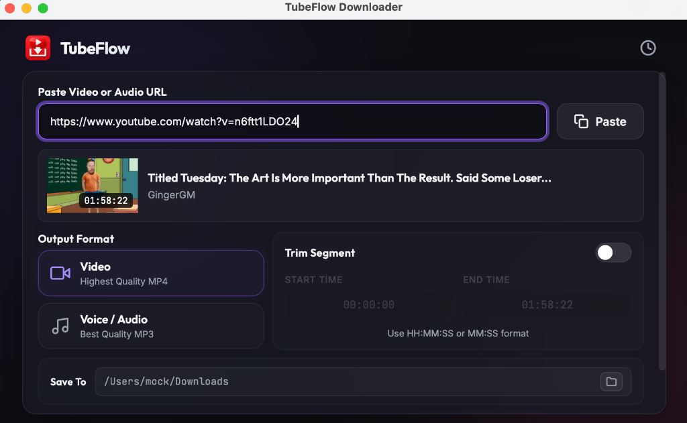

# 📹 Video Downloader

[](https://apple.com)
[](https://python.org)
[](https://opensource.org/licenses/MIT)
[](https://en.wikipedia.org/wiki/Glassmorphism)

A sleek, high-performance, native macOS desktop client for downloading video and audio from YouTube, YouTube Music, and TikTok. Built with a stunning dark-mode glassmorphic interface, it features automatic clipboard monitoring, custom segment trimming, sequential batch downloads, and automatic album art metadata embedding for MP3s.



---

## ⚡ Key Features

* **🚀 Zero-Click Clipboard Monitoring** — Automatically detects video links in your clipboard when the window gains focus, parsing them instantly without requiring you to manually paste.
* **✂️ Timestamp Trimming & Slicing** — Download only the segment you need. Specify a start and end time (e.g. `00:01:20` to `00:03:45`) and the app will execute a lossless keyframe-accurate cut using `ffmpeg`.
* **🎵 MP3 Album Art Embedding** — Extract high-quality audio files from videos and automatically embed the video's thumbnail cover art directly into the MP3's ID3 metadata.
* **📂 Custom Save Locations** — Choose your preferred downloads folder. The app remembers your selection across restarts so you don't have to keep selecting it.
* **⚡ Sequential Batch Downloads** — Paste a list of multiple URLs (separated by spaces, commas, or newlines). The app switches to batch mode and downloads them one by one.
* **📜 Persistent Download History** — Keep a running log of your downloaded files in a sliding sidebar drawer. Includes one-click actions to **Locate in Finder** or remove history items.
* **🛡️ Impersonation Engine** — Bypasses TikTok and YouTube scraping blocks using custom TLS fingerprints (via `curl_cffi` and `yt-dlp`), guaranteeing reliable downloads.

---

## 🛠️ Tech Stack

* **Frontend**: Vanilla HTML5, CSS3 (featuring HSL tailored colors, backdrop-filters, custom micro-animations), and modern ES6+ Javascript.
* **Backend**: Python 3.13, using the [PyWebView](https://pywebview.flowrl.com/) framework for native macOS Cocoa window rendering.
* **Extraction Engine**: [yt-dlp](https://github.com/yt-dlp/yt-dlp) for video/audio stream scraping.
* **Processing Engine**: `ffmpeg` for lossless video cuts, format merging, and thumbnail embedding.

---

## 🚀 Getting Started

### Prerequisites

To run or build the application from source, you will need:
1. **Python 3.13+** installed on your Mac.
2. **FFmpeg** installed (required for trimming and audio post-processing). You can install it via Homebrew:
   ```bash
   brew install ffmpeg
   ```

### Running from Source

1. **Clone the repository**:
   ```bash
   git clone https://github.com/mfarivar/video-downloader.git
   cd video-downloader
   ```

2. **Set up a virtual environment**:
   ```bash
   python3 -m venv .venv
   source .venv/bin/activate
   ```

3. **Install dependencies**:
   ```bash
   pip install -r requirements.txt
   ```

4. **Run the app**:
   ```bash
   python app.py
   ```

---

## 📦 Building the Standalone macOS App (`.app` & `.dmg`)

If you want to package the source files into a compiled desktop application (`.app`) and a distribution installer (`.dmg`), follow these steps:

1. **Compile with PyInstaller**:
   ```bash
   .venv/bin/pyinstaller --clean -y VideoDownloader.spec
   ```
   This will output `Video Downloader.app` in the `dist/` directory.

2. **Generate the DMG Installer**:
   ```bash
   .venv/bin/python build_dmg.py
   ```
   This will generate **`Video Downloader.dmg`** in the `dist/` directory, which you can open and drag-and-drop into your `/Applications` folder.

---

## 🤝 Contributing

Contributions are welcome! If you'd like to improve the UI, add support for more streaming sites, or optimize the downloader:

1. Fork the Project.
2. Create your Feature Branch (`git checkout -b feature/AmazingFeature`).
3. Commit your Changes (`git commit -m 'Add some AmazingFeature'`).
4. Push to the Branch (`git push origin feature/AmazingFeature`).
5. Open a Pull Request.

---

## 📄 License

This project is licensed under the MIT License - see the [LICENSE](LICENSE) file for details.
